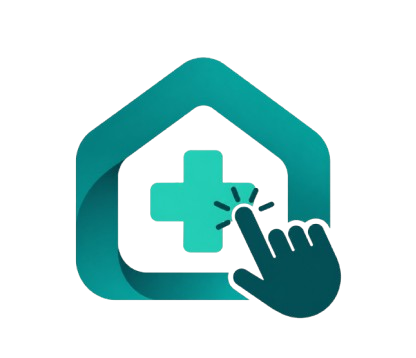

  
  <h1>ClinAi</h1>
  
<strong>Cuidado que começa com escuta.</strong>

  
Tecnologia para aproximar pessoas e tornar o cuidado com a saúde mais simples.

## Quem somos

Somos a ClinAi. Nosso propósito é aproximar pacientes e profissionais de saúde por meio de experiências digitais simples, acessíveis e acolhedoras.

Acreditamos que cuidar começa antes da consulta: começa quando alguém consegue explicar o que sente, encontrar orientação para o próximo passo e ter suas informações organizadas para o atendimento.

Nascemos de um projeto integrador e estamos construindo nossa trajetória na união entre tecnologia e cuidado humano.

## Nossa missão

Facilitar a jornada de cuidado, ajudando pacientes a se preparar para o atendimento e profissionais a compreender melhor as necessidades de cada pessoa.

## Nossa visão

Ser uma referência em tecnologia aplicada à organização do cuidado, com experiências que respeitem o tempo, a autonomia e as diferentes necessidades das pessoas.

## Nossos valores

- **Escuta:** entender as necessidades de quem busca e de quem oferece cuidado.
- **Simplicidade:** tornar cada etapa clara e fácil de compreender.
- **Acessibilidade:** considerar diferentes formas de acessar e usar a tecnologia.
- **Respeito à privacidade:** tratar informações pessoais e de saúde com responsabilidade.
- **Transparência:** comunicar com clareza o que fazemos e os limites das nossas soluções.
- **Colaboração:** construir com diálogo, aprendizado e melhoria contínua.

## Como pensamos o cuidado

Queremos contribuir para uma jornada com menos informações repetidas, mais organização e mais espaço para a conversa entre paciente e profissional.

Para nós, a tecnologia deve apoiar o trabalho de quem cuida e ajudar quem precisa de atendimento a participar dessa jornada com mais clareza. As decisões clínicas pertencem aos profissionais de saúde.

---

  <strong>ClinAi — seu cuidado começa aqui.</strong>
